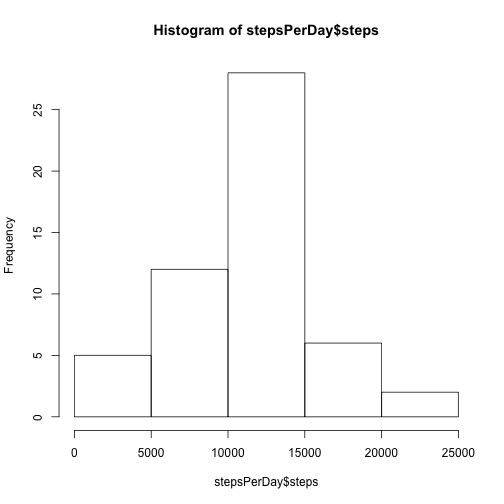
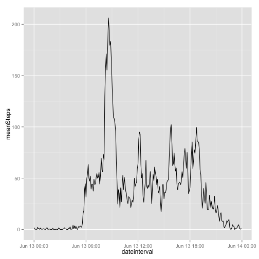
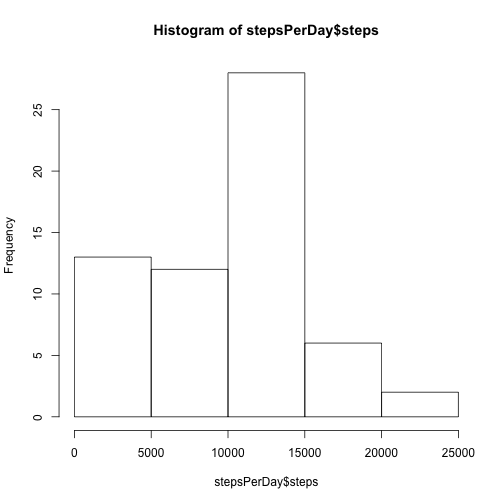
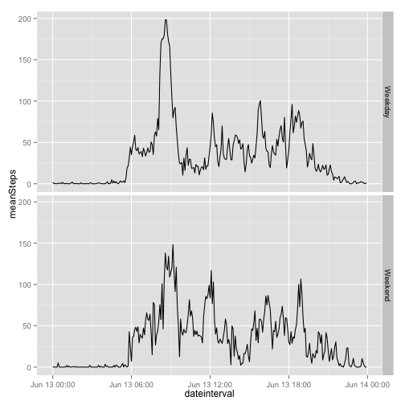

## Loading and preprocessing the data

```r
library(data.table)
unzip("./activity.zip")
activity <- fread("./activity.csv")

#add datetime column combining date and interval
#activity[,datetime:=ymd_hms(paste(date,interval%/%100,interval%%100,"00",sep="-"))]
```


## What is mean total number of steps taken per day?

```r
stepsPerDay <- activity[!is.na(steps)][,.(steps=sum(steps)),by=date]
totalSteps <- sum(stepsPerDay$steps)
meanSteps <- mean(stepsPerDay$steps)
medianSteps <- median(stepsPerDay$steps)
hist(stepsPerDay$steps)
```

 

Total number of steps: 570608

Mean number of steps per day: 1.0766189 &times; 10<sup>4</sup>

Median number of steps per day: 10765

## What is the average daily activity pattern?

Time series plot of the 5-minute interval (x-axis) and the average number of steps taken, averaged across all days (y-axis)

To get rid of the "saw effect", intervals are converted to POSIXit dates, using today's date for the date part (as the date itself does not play the role) and intervals for times.


```r
library(lubridate)
library(ggplot2)

meanActivityByInterval <- activity[,.(meanSteps=mean(steps,na.rm=T)),by=.(interval)]
meanActivityByInterval[,dateinterval:=ymd_hms(paste(today(),interval%/%100,interval%%100,"00",sep="-"))]
```

```
##      interval meanSteps        dateinterval
##   1:        0 1.7169811 2015-06-13 00:00:00
##   2:        5 0.3396226 2015-06-13 00:05:00
##   3:       10 0.1320755 2015-06-13 00:10:00
##   4:       15 0.1509434 2015-06-13 00:15:00
##   5:       20 0.0754717 2015-06-13 00:20:00
##  ---                                       
## 284:     2335 4.6981132 2015-06-13 23:35:00
## 285:     2340 3.3018868 2015-06-13 23:40:00
## 286:     2345 0.6415094 2015-06-13 23:45:00
## 287:     2350 0.2264151 2015-06-13 23:50:00
## 288:     2355 1.0754717 2015-06-13 23:55:00
```

```r
ggplot(meanActivityByInterval, aes(x=dateinterval,y=meanSteps)) + 
	geom_line(stat="identity") 
```

 

On average, the maximum number of steps are made in interval: 835


## Imputing missing values

```r
missingValuesCount <- activity[is.na(steps),.N]

#strategy to imput data is to get median steps per interval (where steps != NA)
# then replace NAs by that median for given interval
medianStepsByInterval <- activity[!is.na(steps),.(steps=median(steps)),by=interval]
setkey(medianStepsByInterval,interval)
setkey(activity,interval)
activity <- medianStepsByInterval[activity]
activity[!is.na(i.steps),steps:=i.steps]
```

```
##        interval steps i.steps       date
##     1:        0     0      NA 2012-10-01
##     2:        0     0       0 2012-10-02
##     3:        0     0       0 2012-10-03
##     4:        0    47      47 2012-10-04
##     5:        0     0       0 2012-10-05
##    ---                                  
## 17564:     2355     0       0 2012-11-26
## 17565:     2355     0       0 2012-11-27
## 17566:     2355     0       0 2012-11-28
## 17567:     2355     0       0 2012-11-29
## 17568:     2355     0      NA 2012-11-30
```

```r
activity$i.steps <- NULL #this just removes i.steps column

stepsPerDay <- activity[,.(steps=sum(steps)),by=date]
totalStepsImput <- sum(stepsPerDay$steps)
meanStepsImput <- mean(stepsPerDay$steps)
medianStepsImput <- median(stepsPerDay$steps)
hist(stepsPerDay$steps)
```

 

Number of missing values: 2304

Mean number of steps per day: 9503.8688525

Median number of steps per day: 10395

###Difference before and after imputing data

Difference between imputed mean and raw mean: -1262.3198268

Difference between imputed median and raw median: -370

Difference between imputed total steps and raw total steps: 9128

## Are there differences in activity patterns between weekdays and weekends?

Panel plot containing a time series plot of the 5-minute interval (x-axis) and the average number of steps taken, averaged across all weekday days or weekend days (y-axis). 

```r
library(lubridate)
library(ggplot2)
activity[,weekday:=ifelse(wday(date)<3,"Weekend","Weekday")]
```

```
##        interval steps       date weekday
##     1:        0     0 2012-10-01 Weekend
##     2:        0     0 2012-10-02 Weekday
##     3:        0     0 2012-10-03 Weekday
##     4:        0    47 2012-10-04 Weekday
##     5:        0     0 2012-10-05 Weekday
##    ---                                  
## 17564:     2355     0 2012-11-26 Weekend
## 17565:     2355     0 2012-11-27 Weekday
## 17566:     2355     0 2012-11-28 Weekday
## 17567:     2355     0 2012-11-29 Weekday
## 17568:     2355     0 2012-11-30 Weekday
```

```r
stepsPerIntervalWeekday <- activity[,.(meanSteps=mean(steps,na.rm=T)),by=.(interval,weekday)]
stepsPerIntervalWeekday[,dateinterval:=ymd_hms(paste(today(),interval%/%100,interval%%100,"00",sep="-"))]
```

```
##      interval weekday meanSteps        dateinterval
##   1:        0 Weekend 0.5882353 2015-06-13 00:00:00
##   2:        0 Weekday 1.8409091 2015-06-13 00:00:00
##   3:        5 Weekend 0.0000000 2015-06-13 00:05:00
##   4:        5 Weekday 0.4090909 2015-06-13 00:05:00
##   5:       10 Weekend 0.0000000 2015-06-13 00:10:00
##  ---                                               
## 572:     2345 Weekday 0.1818182 2015-06-13 23:45:00
## 573:     2350 Weekend 0.0000000 2015-06-13 23:50:00
## 574:     2350 Weekday 0.2727273 2015-06-13 23:50:00
## 575:     2355 Weekend 0.0000000 2015-06-13 23:55:00
## 576:     2355 Weekday 1.2954545 2015-06-13 23:55:00
```

```r
ggplot(stepsPerIntervalWeekday, aes(x=dateinterval,y=meanSteps)) + 
	geom_line(stat="identity", position = 'identity') + facet_grid(weekday ~ .)
```

 

